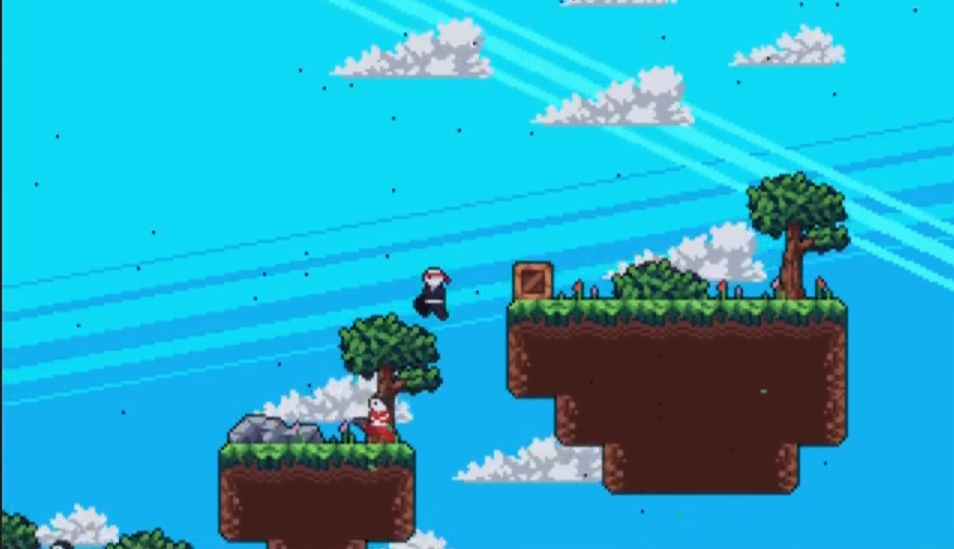

# Kaze no Shinobi 

<p align="center">
  
</p>

> **A 2D Ninja Platformer built with Python and Pygame.**

**Kaze no Shinobi** (Wind of the Ninja) is an action-packed 2D platformer developed using the **Object-Oriented Paradigm (OOP)** in Python. It features custom physics, a tile-based level system, and a standalone level editor, all built without a third-party game engine.

---

## 🎥 Gameplay Demo

See the mechanics in action:

[](https://www.linkedin.com/posts/dev-rayyan-ahmed_gamedevelopment-programming-2dplatformer-activity-7285760820720873472-EDuy?utm_source=social_share_send&utm_medium=member_desktop_web&rcm=ACoAAFHYKnkBn5IigSlcB6FjSc9FX7idBnUGpwg)

---

## 🎮 Features

- **Classic Platforming Action**: Run, jump, and dash through handcrafted levels.
- **Ninja Mechanics**: Smooth movement and combat mechanics tailored for a fast-paced experience.
- **Custom Game Engine**: Built entirely from scratch using **Pygame**; handles collision, rendering, and entity management via OOP.
- **Level Editor**: Includes a built-in editor (`editor.py`) to create and modify tilemaps.

## 📥 Download & Play (No Coding Required)

If you just want to play the game without installing Python:
1. **[Download the Game Here](https://drive.google.com/drive/folders/165xJm3BhnuGvd9EIq84dp8rFfmLGlVKK?usp=drive_link)**.
2. Extract the `.zip` file.
3. Open the extracted folder and run **`Game.exe`**.

---

## 🛠️ Installation (For Developers)

If you want to view the source code or modify the game:

1. **Clone the Repository**
   ```bash
   git clone [https://github.com/Dev-Rayyan-Ahmed/Kaze-no-Shinobi.git](https://github.com/Dev-Rayyan-Ahmed/Kaze-no-Shinobi.git)
   cd Kaze-no-Shinobi
   
2. **Install Dependencies**
   This project relies on `pygame`.
   ```bash
   pip install pygame
  
3. **Run the Game**
   ```bash
   python game.py
   
## 🕹️ Controls

| Action | Key (Keyboard) |
| :--- | :--- |
| **Move Left / Right** | Left Arrow / Right Arrow |
| **Jump** | Up Arrow |
| **Dash / Attack** | X |
| **Quit Game** | Escape |

## 📂 Project Structure

The project uses a modular OOP structure:

* **`game.py`**: The main entry point; initializes the game window and loop.
* **`editor.py`**: A tool for designing levels and saving tilemap data.
* **`scripts/`**: Contains the core logic modules:
    * `entities.py`: Player and enemy classes.
    * `tilemap.py`: Handles grid-based level rendering and collision.
    * `utils.py`: Helper functions for loading assets/images.
* **`data/`**: Stores game assets (images, sound effects, maps).

## 🗺️ Level Editor

To design your own levels:

1. **Run the editor:**
   ```bash
   python editor.py
2. **Place Tiles:** Use Left Click to place tiles or Right Click to remove them.

3. **Select Variants:** Hold Shift + Click to select different tile variants.

4. **Save:** Save your map to the data/maps directory.
---
## 📜 Credits
- Developer: [Rayyan Ahmed](https://github.com/Dev-Rayyan-Ahmed)
- Framework: [Pygame](https://www.pygame.org/news)
---
Created with ❤️ and Python.
